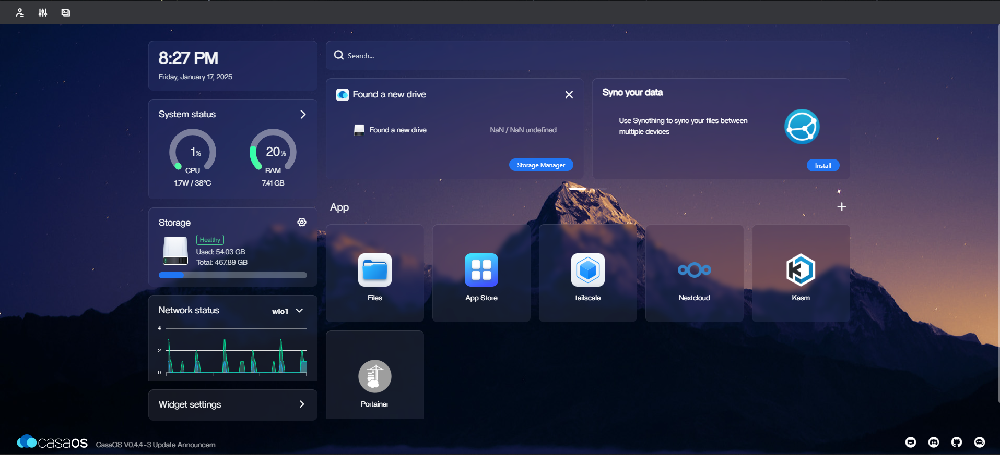

# Create Your Own Home Server Using CasaOS


---

## Introduction
Have you ever thought about creating your own home server? With an old laptop and some free tools, you can set up a powerful server to host files, applications, and services. In this guide, I’ll show you how I used an old Ubuntu-installed laptop, CasaOS, and Tailscale to create a fully functional home server. Let’s get started!

---

## What Is CasaOS
CasaOS is an open-source operating system designed to simplify hosting services and applications on personal servers. It provides an intuitive web interface to manage your server and deploy apps with just a few clicks. CasaOS uses Docker under the hood to manage applications.

### What Is Docker?
[Docker](https://www.docker.com/) is a platform that allows you to create, deploy, and run applications in lightweight, portable containers. Think of containers as isolated environments where an app and its dependencies can run consistently across different systems. This makes Docker an ideal choice for hosting multiple services on a single machine without conflicts.

---

## Setup Process

### 1. Preparing Your Old Laptop
* **Install Ubuntu**: Start by installing the Ubuntu operating system on your old laptop. Ubuntu is lightweight and stable, making it perfect for server use.
* **Update Ubuntu**: Run the following commands to ensure your system is up to date:

```bash
sudo apt update && sudo apt upgrade -y
```

### 2. Installing CasaOS
1. Open a terminal and run the following command to install CasaOS:
```bash
curl -fsSL https://get.casaos.io | sudo bash
```
2. After installation, access CasaOS by opening your browser and navigating to:
```bash
http://<Your-Laptop-IP>:8080
```
3. Complete the setup wizard to configure your CasaOS instance.

[](images/Casa-Dashboard.png)

### View CasaOS Appstore
<video src="images/Casaos-Appstore.mp4" controls="controls" style="max-width: 100%;"></video>

---

## Use Cases

### 1. Personal Cloud Storage
With [Nextcloud](https://nextcloud.com/), you can store, sync, and share files securely across devices without relying on third-party cloud providers.

### 2. Virtual Desktops
Using [Kasm](https://kasmweb.com/), you can create containerized virtual desktops for tasks like development, browsing, or testing.

### 3. Media Server
Install media applications like [Jellyfin](https://jellyfin.org/) or [Plex](https://www.plex.tv/) to host and stream your movies, music, and photos.

### 4. Automation and Smart Home Integration
Use Docker containers to run home automation tools like Home Assistant, bringing intelligence to your smart home.

### 5. Ethical Hacking Applications
You can leverage your home server for ethical hacking training:
* Host penetration testing tools using Docker containers.
* Use Kali Linux in a containerized environment for safe practice.
* Create isolated lab environments for testing.

---

## Remote Access With Tailscale
[Tailscale](https://tailscale.com/) is a VPN solution that allows secure remote access to your server.
1. Install Tailscale using the following commands:
```bash
curl -fsSL https://tailscale.com/install.sh | sh
sudo tailscale up
```
2. Log in to Tailscale using your credentials.
3. Once configured, you can access your server remotely through Tailscale’s private network.

---

***With CasaOS, an old laptop, and a bit of configuration, you can transform your hardware into a versatile home server. Whether it’s hosting files, running applications or practicing ethical hacking, the possibilities are endless. Get started today and unlock the potential of your personal server!***

---

### Essential Links
1. [CasaOS Official Website](https://www.casaos.io)
2. [Docker Documentation](https://www.docker.com/)
3. [Dockerhub](https://hub.docker.com/)
4. [Tailscale Documentation](https://tailscale.com)


